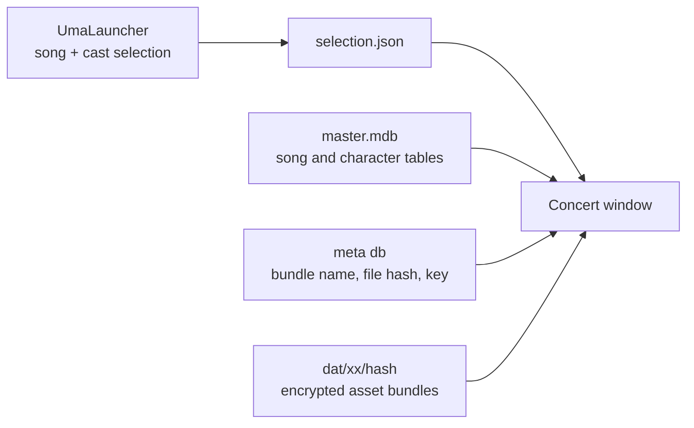

# UV2

A live concert viewer for Umamusume: Pretty Derby, built from scratch. The
UmaLauncher desktop helper is the front end: you pick a song and its cast
there, then the launch button starts this viewer with your selection.

This repository only contains the concert player. It reads the song, stage,
and character data from your own game installation at runtime. Nothing from
the game ships with the exe.

## Requirements

- Windows x64
- Umamusume: Pretty Derby installed (a full, updated install)
- UmaLauncher runs from the same folder as UV2.exe

## How it works

UmaLauncher reads the song, character, and outfit tables from the game
database, you pick the cast, and the launch button writes `selection.json`
(song id and the cast with outfits) next to UV2.exe and starts it. The
viewer reads that file, resolves the stage from the song's settings at
runtime, and opens the concert window with the stage built from the game's
own data: geometry, cast, shaders, dance motion, formation, timeline camera,
stage lighting, crowd, props and mic stands, vocals, and facial animation
with lip sync.

`Config.json` is generated on first run and points at the game's
`umamusume_Data/Persistent` folder if the default is wrong.

## Project structure

```
Assets/
  Scripts/
    app/            entry, scene boot, config, selection json io
    data/           sqlite readers (master + encrypted meta), bundle decrypt stream
    concert/        song catalog, character catalog, member rules
    cutt_stubs/     timeline data classes matching the game's serialized shapes
    ui/             concert window, ui factory
    audio/          awb/hca music and vocal playback
    live/
      camera/       timeline camera driver and character anchor math
      crowd/        audience, cyalume, mob rig
      facial/       facial morph and lip sync drivers
      formation/    formation placement driver
      lights/       blink, spot, laser, wash, foot, volume, shafts, projection
      motion/       dance clip playback
      postfx/       post processing chain (retired, ships disabled)
      props/        stage props and mic rigs
      stage/        stage assembly, shaders, vocal mixer, mirror reflection
      timeline/     worksheet reader, key types, clock, easing
  Editor/           scene baker and batch build entry
  Plugins/          sqlite natives for windows/linux
  Resources/        uv2 post processing shaders
  Shaders/          fog and radial blur shaders
Tools/
  UmaLauncher/      winforms front end: song list, cast picker, updater
ProjectSettings/     unity 2022.3.62, IL2CPP standalone
```

## Architecture



## Building

Unity 2022.3.62f2, IL2CPP, Windows x64. CI builds the exe on every push to
`experimental` and on version tags.

## License

MIT, see LICENSE. This repository contains no game data; the viewer reads
the user's own game installation at runtime.
