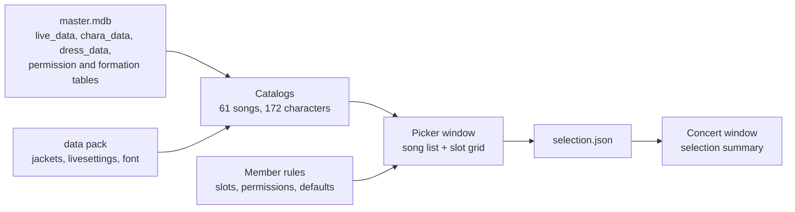

# UV2

A ground-up rebuild of the UmaViewer live concert viewer for Umamusume: Pretty
Derby. Phase 1 is a data browsing surface: it lists the playable live concerts
from the game's own data and lets you pick the characters that perform them,
recording the selection for later phases.

No code or assets from the original viewer are reused. Everything reads from
your own game installation and the extracted data pack that ships next to the
exe.

## Requirements

- Windows x64
- Umamusume: Pretty Derby installed (the game's `umamusume_Data/Persistent`
  folder)
- the phase 1 data pack (jackets, livesettings, game font) unzipped next to
  the exe

## Setup

The app looks for the game data in this order:

1. `Config.json` next to the exe with your game's Persistent folder:
   `{"main_path": "C:\\path\\to\\umamusume_Data\\Persistent"}`
2. fallback: `umamusume_Data/Persistent` next to the exe

master.mdb is read directly from your install (plain SQLite, nothing is
modified). The bundled data pack stays in `UV2_Data/StreamingAssets/data`.

## Project structure

```
Assets/
  Scripts/
    app/            entry, scene boot, config, selection json io
    data/           master.mdb sqlite reader, livesettings csv parser
    concert/        song catalog, character catalog, member rules
    ui/             picker window, concert window, ui factory
  Editor/           scene baker and batch build entry
  Plugins/x86_64/   sqlite native for windows/linux
ProjectSettings/     unity 2022.3.62f2, IL2CPP standalone
docs/               live concert plan (phase 1 scope)
```

## Architecture



Phase 1 proves the two catalogs (songs, characters) and the two joins (stage
wiring, member rules) read correctly. The concert window is a stub that
displays the loaded selection; stage, audio, and timeline land in later
phases.

## Building

Unity 2022.3.62f2, IL2CPP, Windows x64. `Assets/Editor/batch_gate.cs` bakes
the two runtime-built scenes and builds the player in one batch entry.
CI builds the Windows exe on every push to `experimental` and on version tags.

## License

All rights reserved. The bundled game-derived data pack (jacket art,
livesettings, game font) is extracted from Umamusume: Pretty Derby and is not
redistributed in this repository.
