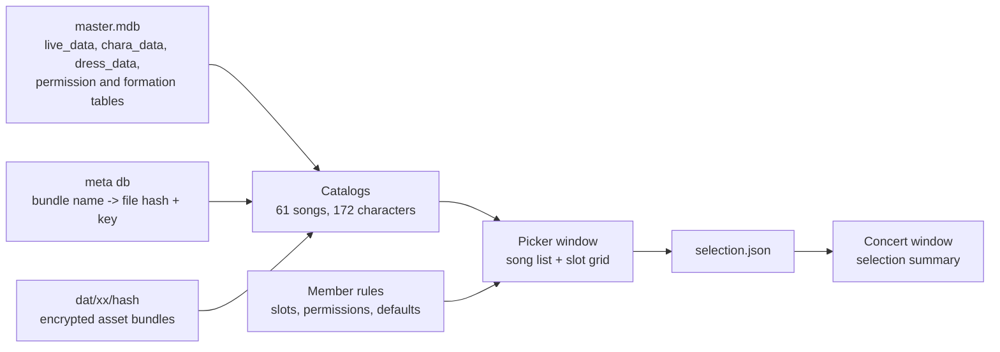

# UV2

A ground-up rebuild of the UmaViewer live concert viewer for Umamusume: Pretty
Derby. Phase 1 is a data browsing surface: it lists the playable live concerts
from the game's own data and lets you pick the characters that perform them,
recording the selection for later phases.

No code or assets from the original viewer are reused. Everything reads from
your own game installation at runtime; nothing game-derived ships with the exe.

## Requirements

- Windows x64
- Umamusume: Pretty Derby installed (a full, updated install; the app reads
  `umamusume_Data/Persistent` for its database, manifest and asset bundles)

## Setup

Run the exe once. A `Config.json` is generated next to it:

```json
{"main_path": "C:\\path\\to\\umamusume_Data\\Persistent"}
```

Point `main_path` at your game's Persistent folder if the default is wrong,
then restart. That is the whole setup: master.mdb (plain SQLite) supplies the
song and character catalogs, the encrypted meta db supplies bundle locations
and per-file keys, and jacket art plus livesettings stream straight out of the
game's own dat files.

## Project structure

```
Assets/
  Scripts/
    app/            entry, scene boot, config, selection json io
    data/           sqlite readers (master + encrypted meta), bundle decrypt stream
    concert/        song catalog, character catalog, member rules
    ui/             picker window, concert window, ui factory
  Editor/           scene baker and batch build entry
  Plugins/          sqlite natives for windows/linux
ProjectSettings/     unity 2022.3.62, IL2CPP standalone
```

## Architecture



Phase 1 proves the two catalogs (songs, characters) and the two joins (stage
wiring, member rules) read correctly. The concert window is a stub that
displays the loaded selection; stage, audio, and timeline land in later
phases.

## Building

Unity 2022.3.62f2, IL2CPP, Windows x64. `Assets/Editor/batch_gate.cs` bakes
the two runtime-built scenes and builds the player in one batch entry.
CI builds the Windows exe on every push to `experimental` and on version tags.

## License

All rights reserved. This repository contains no game data; the application
reads the user's own game installation at runtime.
